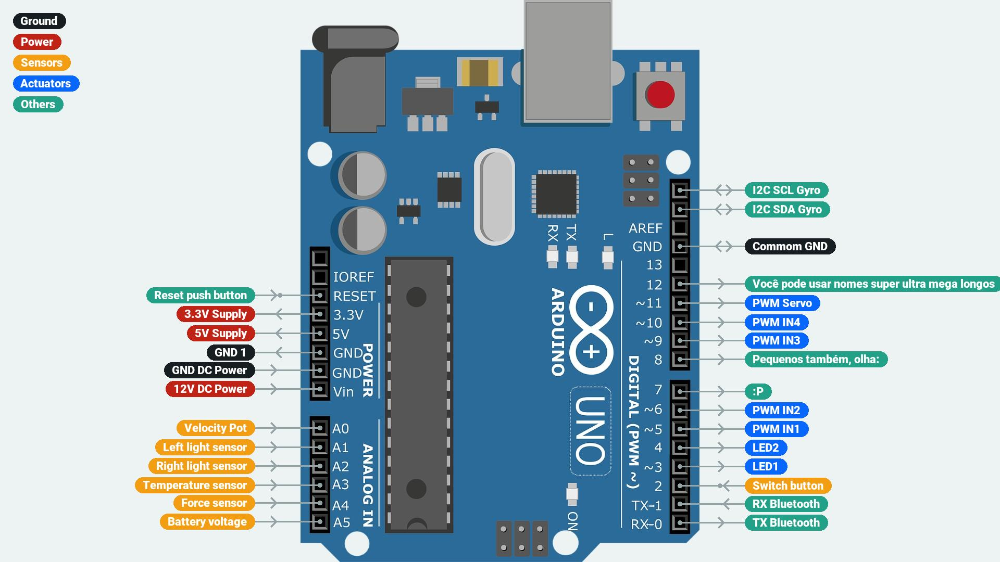

# Arduino Pinout Maker
Um criador de pinout do arduino para os seus projetos :)

# Exemplos
Gerado com o [exemplo](./examples/example.json)
Exemplo mais simples com poucas configurações.


---
Gerado com o [allPorts](./examples/allPorts.json)
Exemplo usando todas as portas do arduino UNO.


---
Gerado com o [styles](./examples/styles.json)
Exemplo ousando nas configurações de cores e tamanhos.



# Como usar
## Configurações
As configurações são feitas no arquivo JSON, o arquivo de [boards](data/boards.json) contém os padrões, além da posição de cada pino.

As principais são:
- `ImagePath`: Caminho da imagem do arduino
- `FontPath`: Caminho da fonte do texto
- [`Colors`](#cores): Cores de cada tipo de conexão
- [`Sizes`](#tamanhos): Configurações de tamanho
```json
{
    "Settings":{
        "ImagePath": "",
        "FontPath": "",

        "Colors": {},
        "Sizes": {}
    }
}
```

### Cores
As configurações de cor guardam as cores de cada tipo de porta (como se fossem classes), seu background e cor do texto. As cores são armazenadas em uma lista RGBA. A configuração de `Connections` diz a cor do fio.
```json
"Colors": {
    "Connections": [
        148,
        163,
        166,
        255
    ],
    "PortTypes": {
        "Default": {
            "Background": [
                241,
                196,
                55,
                255
            ],
            "Text": [
                255,
                255,
                255,
                255
            ]
        }
    }
}
```
### Tamanhos
As configurações de tamanho guardam cada tamanho de cada elemento, como o tamanho do texto, o tamanho do fio e o tamanho do pino.
```json
"Sizes": {
    "Connections": {
        "Radius": 4,
        "Size": 140,
        "Width": 3
    },
    "Names": {
        "Height": 30,
        "Border": 15,
        "BorderRadius": 20,
        "Font": 22
    }
}
```
## Conexões
As conexões também são feitas no arquivo JSON, assim como o exemplo abaixo.
- `Name`: Nome da conexão (que aparece dentro do oblongo)
- `InOut`: Tipo de conexão (entrada, entrada com pullup, saída ou entrada e saída)
- `Type`: Tipo da conexão (que define a cor do oblongo e do texto)
```json
"Connections": {
    "D11": {
        "Name": "PWM Servo 1",
        "InOut": "Output",
        "Type": "Default"
    },
    "D10": {
        "Name": "Push button",
        "InOut": "Input",
        "Type": "Default"
    },
    "D9": {
        "Name": "Communication",
        "InOut": "InputOutput",
        "Type": "Default"
    },
    "D8": {
        "Name": "Push button",
        "InOut": "InputPullup",
        "Type": "Default"
    }
}
```

Esse exemplo cria 3 conexões no pino D11, D10 e D9, respectivamente.

